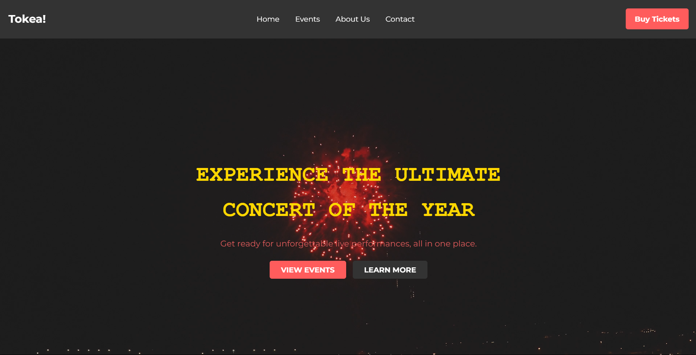

# Tokea! - Event and Ticketing Website

Welcome to **Tokea!**, your ultimate destination for experiencing live events, concerts, and festivals worldwide. This website allows users to explore upcoming events, purchase tickets, and learn more about the vibrant world of live entertainment.

## Screenshot


## Features
- **Home Page**: Engaging landing page with a video background, upcoming events slider, and a countdown to the next big announcement.
- **Events Page**: Displays detailed information about upcoming events, including descriptions and locations.
- **Ticketing Page**: Allows users to buy tickets for various events.
- **About Us Page**: Shares the mission and values of Tokea!.
- **Contact Us Page**: Provides a form for users to reach out for inquiries or support.

## Technologies Used
- **HTML**: For structuring the website.
- **CSS**: For styling and layout.
- **JavaScript**: For interactivity, including modals and countdown timers.
- **Responsive Design**: The website is designed to be mobile-friendly.

## Installation
To run this project locally, follow these steps:

1. Clone the repository:
   ```bash
   git clone https://github.com/albertrono/Tokea-.git
